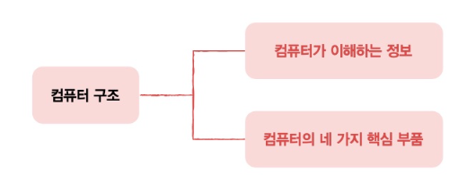
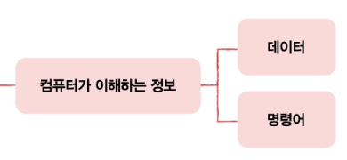
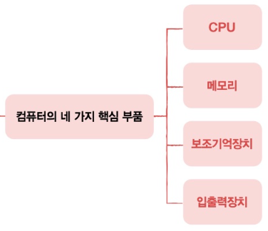

## 1 컴퓨터 구조를 알아야 하는 이유

***

컴퓨터 구조는 실력있는 개발자라면 반드시 알아야 할 기본 지식

***

> :carrot: 문제해결  
>>코드상의 문제가 없는데 코드가 제대로 작동하지 않을 때    
>>컴퓨터를 '미지의 대상'이 아닌 '분석의 대상'으로..   
>> 기업에서도 기술 면접으로 컴퓨터 구조에 대한 소양을 검증
> 
> `컴퓨터 구조 지식은 코드를 작성하는 개발자를 넘어 다양한 문제를 스스로 해결할 줄 아는 개발자로 만들어준다. `

***

> 성능, 용량, 비용   
>> 서버 컴퓨터...어떤 CPU를 사용해야 할지? 어떤 메모리를 사용해야 할지?   
>> 개발한 프로그램이 어떤 환경에서 어떻게 작동하는지 알아야 최적의 컴퓨터 환경을 판단할 수 있다.    
> 
> `컴퓨터 구조를 이해하면 성능, 용량, 비용까지 고려하여 개발하는 개발자가 될 수 있다.`

***

## 2 컴퓨터 구조의 큰그림

***

> 컴퓨터가 이해하는 정보   
> 
>> 데이터 : 컴퓨터가 이해하는 숫자, 문자, 이미지, 동영상과 같은 정적인 정보   
>> 명령어 : 데이터를 움직이고 컴퓨터를 작동시키는 정보
>
> `명령어는 컴퓨터를 작동시키는 정보`   
> `데이터는 명령어를 위해 존재하는 재료`
***

> 컴퓨터의 4가지 핵심 부품   
>    
>> CPU :   
>> 메모리 : 현재 실행되는 프로그램의 명령어와 데이터를 저장하는 부품   
>> 보조기억장치 :    
>> 입출력장치 :   

  
